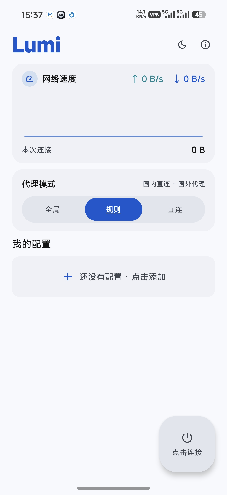
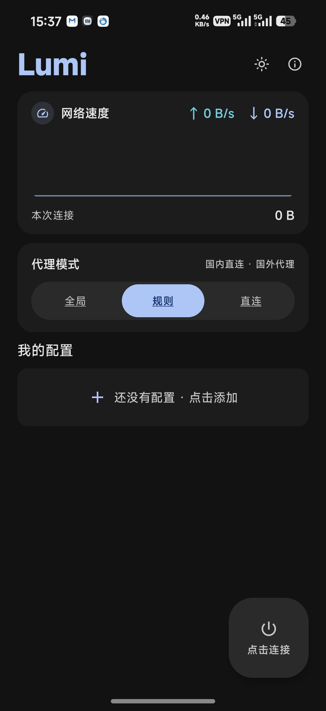
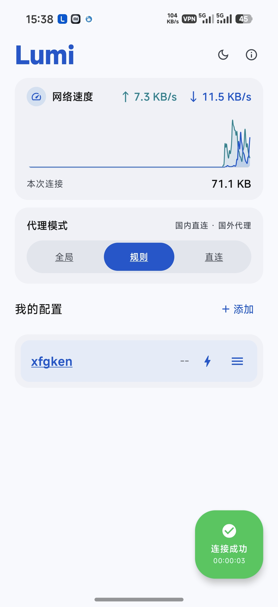
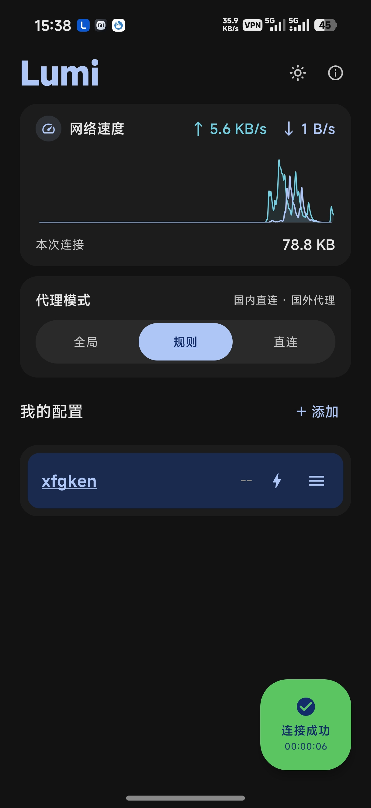

# Lumi — 纯 Hysteria2 Android VPN 客户端

> **专为中国用户而开发的这款 App**：界面全中文、开箱即用，内置国内直连分流与
> GeoIP 列表，支持常见机场的 `hysteria2://` 分享链接，下载安装即可上手。

> 轻量、开箱即用的 Hysteria2 VPN 客户端，Kotlin + Jetpack Compose + Material 3 构建，
> 内置官方 [apernet/hysteria](https://github.com/apernet/hysteria) Go 核心（gvisor netstack），免 Root。

| 项目 | 值 |
|---|---|
| 包名 | `com.xfgken.Lumi` |
| 最低系统 | Android 8.0 (API 26) |
| 目标 SDK | 37 |
| 架构 | arm64-v8a |
| 版本 | v1.4.0 |
| 语言 | Kotlin / Go (JNI) |

---

## 📱 界面预览

<p align="center">
  
  
  
  
</p>
<p align="center">
  浅色 · 空态 ｜ 深色 · 空态 ｜ 浅色 · 已连接（实时网速曲线）｜ 深色 · 已连接
</p>

---

## ✨ 功能特性

### 连接核心
- ✅ **官方 Hysteria2 Go 核心**（QUIC、TLS、Salamander 混淆、带宽控制、UDP 全支持）
- ✅ VpnService + TUN + **gVisor IP 栈**，系统级 VPN，无需 Root
- ✅ 域名**预解析为 IP** 直连 + 失败自动回退原域名（减少 DNS 污染窗口）
- ✅ **SNI 安全纠偏**：关闭"允许不安全"时若 SNI 与服务器域名不一致，自动改用域名校验（不降级安全）
- ✅ 证书错误**人话诊断**（日志中直接说明证书/SAN/服务器问题）
- ✅ 代理模式：**全局 / 规则（国内直连·国外代理）/ 直连** 一键切换
- ✅ DNS 防泄漏分流 + 国内 IP 直连（GeoIP 列表内置 `assets/china_ipv4.txt`，构建无需联网下载）
- ✅ 断线自动重连、快速连点竞态保护、编辑已连接节点保存后自动重连生效

### 节点管理
- ✅ `hysteria2://` 分享链接导入（粘贴 / 剪贴板识别）
- ✅ 手动添加：服务器、端口、密码、SNI、上行/下行带宽、混淆、允许不安全
- ✅ 编辑 / 删除 / 实时切换（连接中点击另一节点自动断开重连）/ 复制订阅链接
- ✅ 配置存储经 **Keystore AES-GCM 加密**（密码/混淆密钥不明文落盘）

### 体验与可视化
- ✅ Material 3 动态配色，浅色/深色**丝滑切换**（全局色板渐变 + 组件同步）
- ✅ 首页实时网速卡：上行/下行双色**平滑滚动曲线**（时间轴流动，无跳格）+ 本次流量统计
- ✅ 连接按钮连接成功后显示 **HH:MM:SS 连接时长**
- ✅ 节点延迟测试三态：正常 ms 分档显色 / **超时（黄）** / **不可达（红）**
- ✅ 运行日志窗口化（贴底控制台面板）：信息**青绿** / 警告**黄** / 错误**红**，一键复制 / 清空
- ✅ 错误横幅 6 秒自动消失；点击顶部 **Lumi 标题**随时查看运行日志

---

## 🗂 项目结构

```
Lumi/
├── app/                          # Android 应用主模块（全部 UI/逻辑）
│   └── src/main/java/com/xfgken/Lumi/
│       ├── ui/                   # Compose 页面（Home / Log + 组件）
│       ├── ui/theme/             # MD3 主题（浅深双色板 + 全角色色渐变动画）
│       ├── viewmodel/            # MainViewModel（状态机/统计/设置）
│       ├── vpn/                  # VpnService + VpnController + 连接编排
│       ├── core/                 # Hysteria2 URI 解析器 / 序列化
│       ├── data/                 # Room（节点/日志）+ DataStore 设置
│       ├── model/ utils/         # 数据模型 / 测速等工具
│       └── assets/china_ipv4.txt # GeoIP 国内 IP 列表（分流用，已内置）
├── hysteria/                     # Hysteria2 Kotlin 封装模块（预编译 golib.aar + 封装）
│   └── libs/golib.aar            # 预编译 Go 核心（JNI .so），仓库已内置
├── go/                           # Go 核心源码（main/tun/hysteria/rules + JNI glue），
│                                 #   仅供对照参考——修改后需自行编译为 golib.aar
├── gradle/ libs.versions.toml    # 版本目录
├── gradlew                       # Gradle Wrapper（clone 即用，无需预装 Gradle）
└── settings.gradle.kts / build.gradle.kts
```

> 提示：`hysteria/libs/golib.aar` 是**预编译二进制**（约 5MB），日常 App 开发无需 Go 工具链；
> 只有需要修改 Go 核心行为（代理规则/TUN 参数等）时才需要 Go 交叉编译流程。

---

## 🚀 编译（如何构建）

### 环境要求

| 依赖 | 版本 | 说明 |
|---|---|---|
| JDK | **17+** | 项目 `source/target = 17` |
| Android SDK | API 37 (compileSdk) | AGP 会自动下载缺失组件（需联网） |
| Gradle | **9.4.1** | 已内置 **Wrapper**，无需手动安装 |
| Android Studio | Ladybug+（可选） | 推荐 IDE |

> **注意**：`gradle.properties` 中有一行 `android.aapt2FromMavenOverride=/opt/tools/aapt2`，
> 它是本机 ARM64 Linux 构建环境的专用配置；**在 Windows / macOS / x86_64 Linux 上构建请删除该行**，
> 否则会因找不到该路径而报错。

### 方式 A：Android Studio（推荐）

```bash
git clone https://github.com/xfgken/Lumi.git
```

1. Android Studio → **Open** 选择克隆目录，等待 Gradle Sync 完成；
2. （删除上文的 `aapt2FromMavenOverride` 行）
3. 直接点 **Run ▶** 跑 debug 版，或 **Build → Build APK(s)**。

### 方式 B：命令行

```bash
git clone https://github.com/xfgken/Lumi.git
cd Lumi

# debug 版（无需签名配置，可直接安装）
./gradlew :app:assembleDebug
# 产物：app/build/outputs/apk/debug/app-debug.apk

# release 版（需要签名配置，见下文）
./gradlew :app:assembleRelease
# 产物：app/build/outputs/apk/release/app-release.apk
```

首次构建会下载 Gradle 发行版与依赖，耗时取决于网络。产物为 **arm64-v8a** 单架构。

### 签名说明（release 必读）

仓库**不含任何密钥文件**（`.gitignore` 已排除 `*.jks` / `keystore.properties`）。
要产出可安装的 release APK，请在项目根目录新建 `keystore.properties`：

```properties
storeFile=/绝对路径/你的.jks
storePassword=你的密钥库密码
keyAlias=你的别名
keyPassword=你的别名密码
```

没有自己的签名？用 Android Studio 生成一个（Build → Generate Signed APK →
Create new keystore），或直接使用 debug 版自测。

---

## 📲 安装与使用

1. 安装 APK（Android 8.0+，arm64 设备；覆盖安装升级请保持签名一致）；
2. 打开 App → 点「添加」→ **粘贴 hysteria2 分享链接自动解析**，或手动填写：

| 字段 | 说明 |
|---|---|
| 服务器 / 端口 | 如 `v.example.com` / `443` |
| 密码 | 服务端 auth 密码 |
| SNI | 证书域名；伪装场景可填其他域名 |
| 上行 / 下行 | 带宽上限 Mbps（可留默认） |
| 混淆 | `salamander` 需与服务端一致（服务端开启才填） |
| 允许不安全 | 见下方 FAQ |

3. 点击配置行选中 → 右下角连接按钮；
4. 右上角 ☀️/🌙 切换深浅主题，点 **Lumi 标题** 打开运行日志。

---

## ❓ 常见问题（FAQ）

**Q1：连接报 `x509: certificate relies on legacy Common Name field, use SANs instead`**
这是**服务器证书问题**：hysteria 服务端加载的证书缺少 SAN 扩展（Go 1.15+ 强制拒绝）。
请给服务端换一张带 SAN 的证书（如 Let's Encrypt certbot 的
`fullchain.pem` + `privkey.pem`），App 端无需修改。

**Q2：关闭「允许不安全」就连不上，开启才行？**
说明该节点的 SNI 是"伪装域名"（如 `www.cloudflare.com`）且服务器证书与该域名不匹配。
Lumi 会在关闭不安全时自动把 SNI 纠偏为服务器域名（安全不降级）；若仍失败，多半是
Q1 的无 SAN 老证书问题。**伪装型节点只能开启"允许不安全"**——这是节点设计，不是 App 缺陷。

**Q3：测延迟显示「超时/不可达」？**
- 超时 = 端口可达但握手超时（可能被防火墙丢包）；
- 不可达 = 连接被拒绝/网络错误；
测完结果自动保存，重测成功才恢复 ms 数值。

**Q4：日志里出现 `use of closed network connection`？**
网络切换/重连瞬间 DNS 查询落在已关闭连接上，属正常自愈，无需处理；
若几十秒一轮地频繁重建，把重建前几行日志发 issue 分析。

**Q5：深色/浅色切换后个别元素颜色跟不上？**
版本 v1.4.0 已修复（主题渐变窗口内组件颜色直跟色板，全屏同步渐变）。

---

## 📜 版本历史

### v1.4.0
- 日志窗口视觉多轮打磨：贴底控制台面板、时间+类型同淡色实底块、按钮组间距统一、色块尺寸/圆角调优
- 网速曲线改为**时间轴平滑滚动**（帧驱动、无跳格、尾部贴右缘、峰值缓降）
- 深浅主题切换**全组件同步渐变**（消除胶囊/配置列表/连接按钮"慢半拍"）
- 关于页重构：去 SVG 图标、软件名大标题 + 详细项目信息列表
- 日志入口改点击顶部 **Lumi 标题**（移除右上角按钮）
- 版本升至 v1.4.0（versionCode 5），内置 Gradle Wrapper

### v1.3.0（前序迭代合并）
- 日志类型色改版（信息青绿 / 警告黄 / 错误红）
- 延迟测速三态（正常 / 超时黄 / 不可达红）持久化
- 日志窗口化与行结构多轮改版

### v1.2.0（前序迭代合并）
- 全源码审计 + P0/P1 修复（连接时长恢复显示、快速连点竞态、编辑连接中节点自动重连等）
- 死代码清理；错误横幅 6 秒自动消失

### v1.1.0（前序迭代合并）
- SNI 安全纠偏 + 证书错误可读诊断；域名预解析 + UDP 四冗余 DNS
- 基础版本：三区块 UI、节点管理、加密存储、规则分流、运行日志

---

## 🛡 隐私与安全

- 节点密码 / 混淆密钥使用 **Android Keystore AES-GCM** 加密后入库，不明文落盘；
- 日志仅保存在本机 Room 数据库，支持一键清空；
- 分流遵循"国内直连、国外经隧道"，默认不劫持国内流量；
- 本项目**不包含任何订阅源 / 服务器**，请自备合规服务。

## ⚖️ 免责声明

本项目仅供学习与技术交流，使用者应遵守所在国家/地区的法律法规，
请勿用于任何非法用途。因使用本项目产生的一切后果由使用者自行承担。